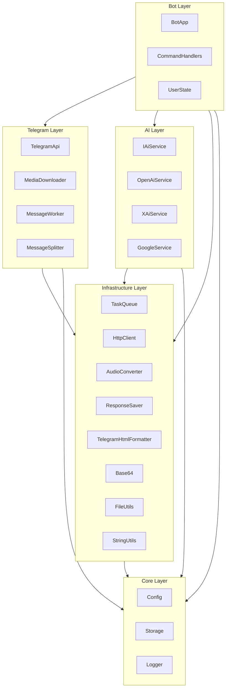
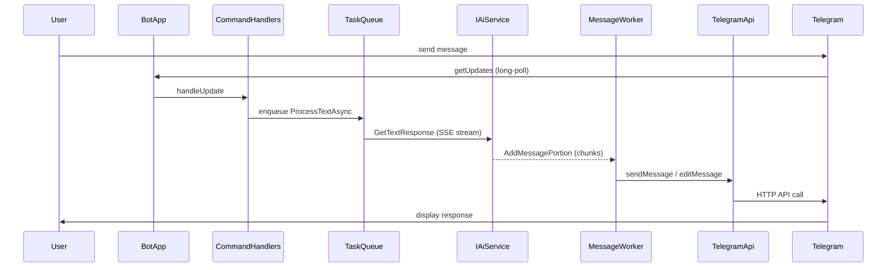
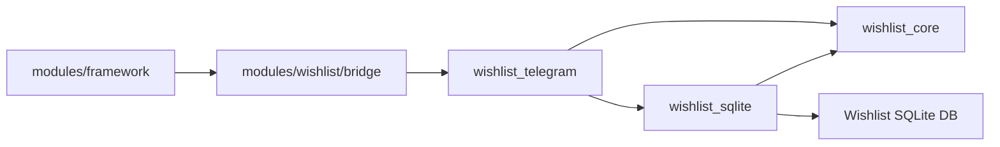

# Architecture

This document describes the high-level architecture of MyBuddyBot.

## Component Diagram

The project is organised into five layers. Each layer depends only on layers below it.

## Message Flow

The sequence below traces a typical text message from the user through all layers and back.

## Threading Model

| Thread | Count | Responsibility |
|--------|-------|----------------|
| **Main polling thread** | 1 | Runs `BotApp::Run()` — calls `getUpdates` in a loop (3 s timeout) and dispatches each update to `CommandHandlers`. |
| **TaskQueue workers** | *N* (default = CPU count, override with `MYBUDDYBOT_WORKER_THREADS`) | Execute async tasks (`ProcessTextAsync`, `ProcessVoiceAsync`, `ProcessImageAsync`). Each task calls the AI service, stores history in `Storage`, and pushes streaming chunks to `MessageWorker`. |
| **MessageWorker thread** | 1 | Singleton background loop that wakes every 3 s (or on new data). Batches streaming chunks and sends/edits messages via `TelegramApi`. Delegates text splitting to `MessageSplitter` and Markdown→HTML conversion to `TelegramHtmlFormatter`. |

## Module System

Rust-based feature modules are loaded via `ModuleHost`. Each module implements the `IModule` interface and is registered in `BotApp::InitializeComponents()`.

Module registration is **config-driven**: each module is gated by an environment variable `MYBUDDYBOT_MODULE_<NAME>`. Modules are **enabled by default**; set the variable to `0` to disable. The bot logs the status of each module at startup.

| Module | Env Variable | Default |
|--------|-------------|---------|
| Wishlist | `MYBUDDYBOT_MODULE_WISHLIST` | Enabled |

The Wishlist module uses a separate SQLite database. Its path is configurable via `MYBUDDYBOT_MODULE_WISHLIST_DB` (defaults to `wishlist.db` in the same directory as the main database).

### Wishlist Module Internals

The Wishlist module lives under a dedicated feature root at `modules/wishlist/`. CMake imports the Rust `wishlist_telegram` crate via Corrosion, while the adjacent C++ bridge adapts it to the host module interface.

| Component | Responsibility |
|------|----------------|
| `modules/framework` | Shared module system contracts and routing (`IModule`, `ModuleHost`) |
| `modules/services` | Host services exposed to modules (`ModuleOps`, `TelegramOps`) |
| `modules/wishlist/bridge` | C++ adapter that exposes Wishlist as an `IModule` |
| `modules/wishlist/telegram` | Rust Telegram/controller layer, CXX exports, callback and session flow |
| `modules/wishlist/core` | Domain types, use-case services, repository traits, domain events, validation |
| `modules/wishlist/sqlite` | `rusqlite` repositories and schema initialization for families, lists, and wishes |

## Shared State

All shared state is protected by mutexes:

- **TaskQueue** — `mutex_` + `condition_variable` guards the task deque.
- **MessageWorker** — `mutex_` + `condition_variable` guards the message-block queue; an `atomic<bool>` signals new data.
- **TelegramApi** — `apiMutex_` serialises every Telegram API call (the underlying library is not thread-safe).
- **Storage** — `dbMutex` serialises SQLite access.
- **UserState** — per-instance `mutex_` protects the state maps.
- **Wishlist module (Rust)** — session/input tracking in `WishlistModule` is protected by `Mutex<HashMap/...>` and each SQLite adapter wraps its connection in `Mutex<Connection>`.
