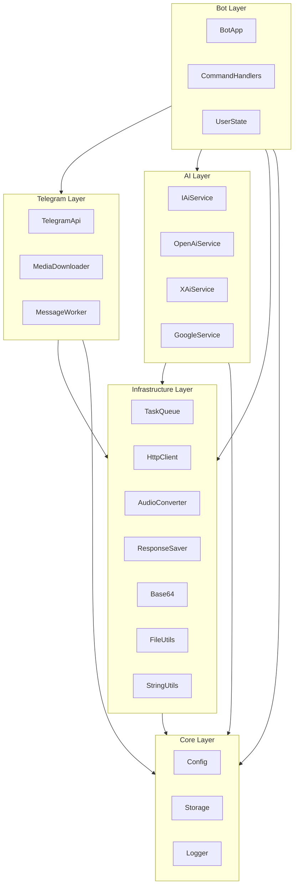
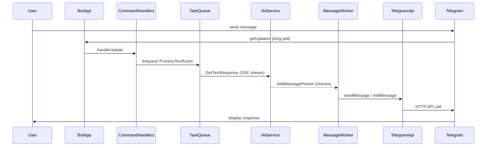

# Architecture

This document describes the high-level architecture of MyBuddyBot.

## Component Diagram

The project is organised into five layers. Each layer depends only on layers below it.

## Message Flow

The sequence below traces a typical text message from the user through all layers and back.

## Threading Model

| Thread | Count | Responsibility |
|--------|-------|----------------|
| **Main polling thread** | 1 | Runs `BotApp::Run()` — calls `getUpdates` in a loop (3 s timeout) and dispatches each update to `CommandHandlers`. |
| **TaskQueue workers** | *N* (default = CPU count, override with `MYBUDDYBOT_WORKER_THREADS`) | Execute async tasks (`ProcessTextAsync`, `ProcessVoiceAsync`, `ProcessImageAsync`). Each task calls the AI service, stores history in `Storage`, and pushes streaming chunks to `MessageWorker`. |
| **MessageWorker thread** | 1 | Singleton background loop that wakes every 3 s (or on new data). Batches streaming chunks, splits long messages at the 4096-char Telegram limit, converts Markdown to HTML, and sends/edits messages via `TelegramApi`. |

All shared state is protected by mutexes:

- **TaskQueue** — `mutex_` + `condition_variable` guards the task deque.
- **MessageWorker** — `mutex_` + `condition_variable` guards the message-block queue; an `atomic<bool>` signals new data.
- **TelegramApi** — `apiMutex_` serialises every Telegram API call (the underlying library is not thread-safe).
- **Storage** — `dbMutex` serialises SQLite access.
- **UserState** — per-instance `mutex_` protects the state maps.
